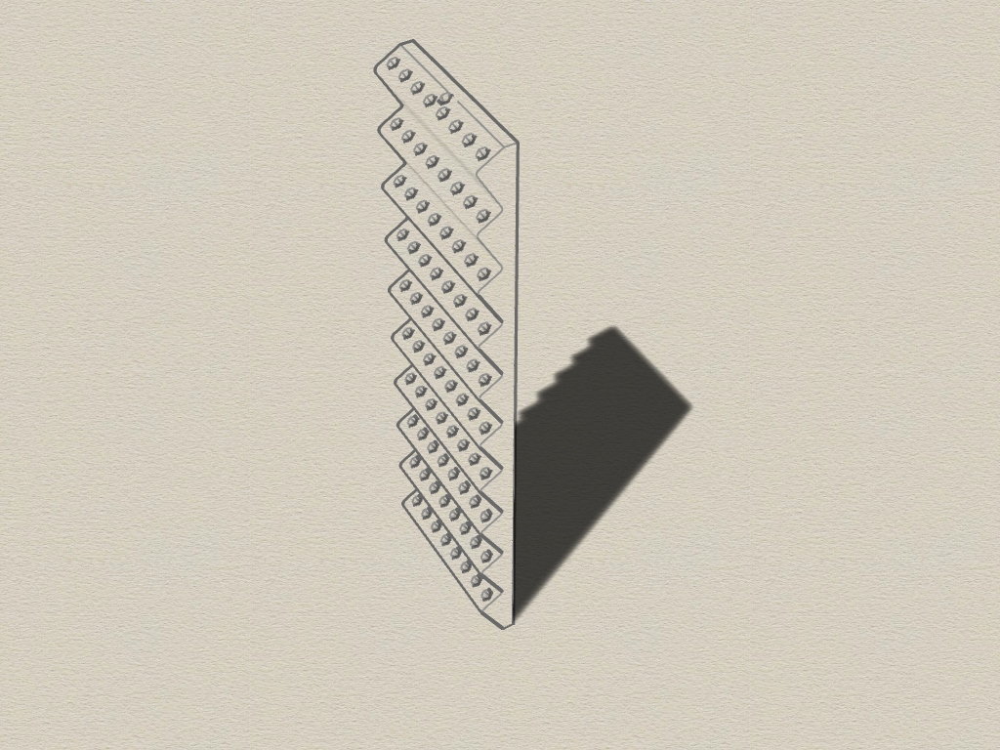
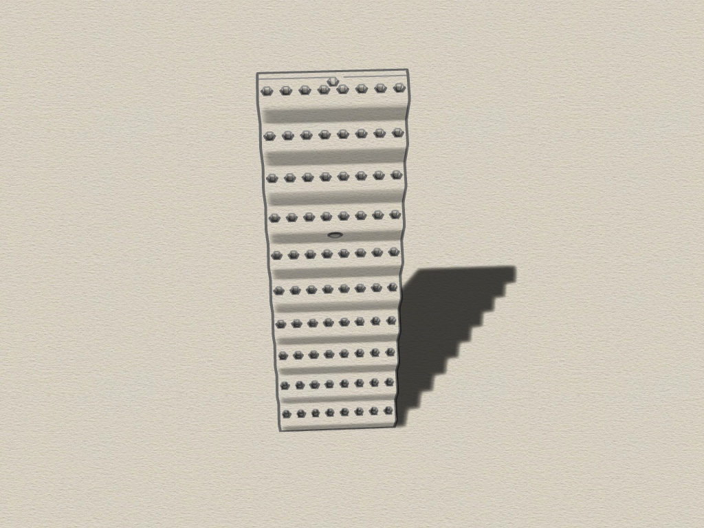
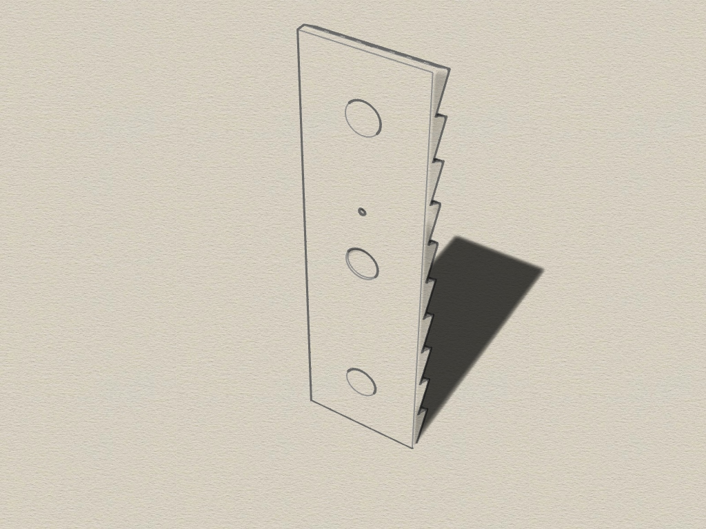

# Microbit-Bit-holders
3D printable wall-mountable holders for Microbit-Bits. 

I got a Xiaomi WowStick 1F Pro. It was delivered with three tubes. Each of it has 20 Microbits for different screws. From my older Xiaoni WowStick 1 i had one more tube. The problem was, the Microbits fall out off the tubes because the cap was too loose.
So i created this Microbit holder. You can mount it to the wall with a 4 mm screw or you can place a 20 x 1,5 mm neodym magnet on the backside to place it on any metall surface.

The Microbit-holder consists of 1 part. There are two Versions. One for 60 parts, one more for 80 parts. The WowStick can be placed on top of the holder.

Requirements:
* 3D printer 
* Filament of your choice

#### View

